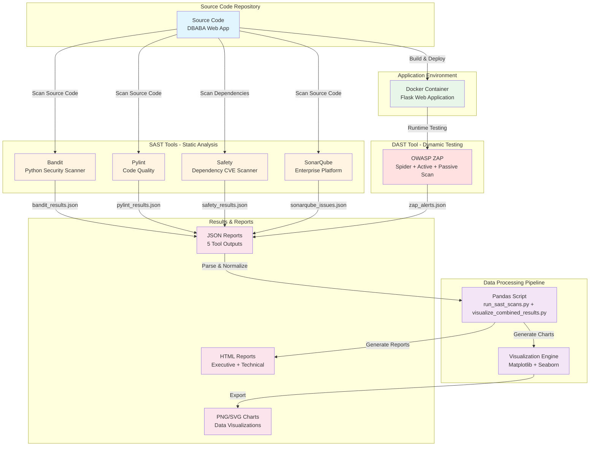
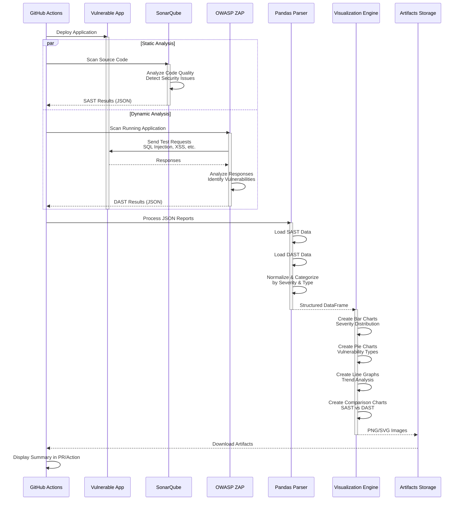

# Multi-Tool SAST & DAST Security Testing Pipeline


> **An automated security testing pipeline integrating 5 industry-standard tools (Bandit, Pylint, Safety, SonarQube, OWASP ZAP) with comprehensive data visualization and reporting.**

This project demonstrates a production-ready approach to integrating multiple security scanning tools into a unified DevSecOps pipeline, with automated result aggregation and visual reporting.

---

## 📋 Table of Contents

- [Overview](#overview)
- [Interview Walkthrough](#-interview-walkthrough---what-i-built)
- [Architecture](#architecture)
- [Security Tools Implemented](#-security-tools-implemented)
- [Technical Implementation](#technical-implementation)
- [Getting Started](#getting-started)
- [Understanding the Results](#understanding-the-results)
- [Resources](#resources)

---

## 🎯 Overview

### What I Built

An **enterprise-grade automated security testing pipeline** that:

1. **Multi-Tool SAST Analysis** - Integrates 4 static analysis tools:
   - **Bandit**: Python security vulnerability scanner (hardcoded secrets, SQL injection patterns)
   - **Pylint**: Code quality and security linting
   - **Safety**: Dependency vulnerability scanner (CVE detection)
   - **SonarQube**: Enterprise code quality and security platform

2. **Dynamic Application Security Testing (DAST)** - Uses OWASP ZAP:
   - Active scanning for OWASP Top 10 vulnerabilities
   - Spider/crawler for complete application mapping
   - Passive traffic analysis

3. **Automated Data Processing Pipeline**:
   - Custom Python scripts to parse and normalize outputs from all 5 tools
   - Pandas-based data aggregation and analysis
   - Automated report generation in multiple formats (JSON, HTML, PNG)

4. **Containerized Infrastructure**:
   - Docker Compose orchestration of 3 services
   - Network-isolated security testing environment
   - Reproducible and portable architecture

5. **Comprehensive Visualization System**:
   - Multi-dimensional security dashboards
   - Severity distribution analysis
   - Tool comparison metrics
   - Executive summary reports

### What is SAST vs DAST?

| **SAST (Static Analysis)** | **DAST (Dynamic Analysis)** |
|----------------------------|------------------------------|
| Analyzes source code without running it | Tests the running application |
| Finds coding errors and security flaws | Finds runtime vulnerabilities |
| Works like a code review | Works like a penetration test |
| Fast, early in development | Slower, tests real behavior |
| **My Implementation: Bandit, Pylint, Safety, SonarQube** | **My Implementation: OWASP ZAP** |

**Why use both?** SAST catches issues in code before deployment (shift-left security), while DAST finds runtime vulnerabilities that only manifest in a live environment. Combined, they provide defense-in-depth security coverage.

---

## 🎯 Project Overview - Technical Implementation

### Problem Statement

Security testing tools are often used in isolation, producing disparate reports that require manual correlation. Organizations typically run Bandit, SonarQube, and OWASP ZAP separately, then manually aggregate findings across multiple formats and severity scales. This project addresses that gap by creating an automated pipeline that:
- Executes multiple security scanners in parallel
- Aggregates results from heterogeneous data sources into unified reports
- Provides multi-dimensional visualizations for technical and executive audiences
- Runs in a containerized, reproducible environment

### Solution Architecture

**Multi-Tool SAST Pipeline** - 4 static analysis tools executed in parallel:
- **Bandit**: Python-specific security vulnerability detection (B201-B999 security tests)
- **Pylint**: Code quality and security anti-pattern analysis
- **Safety**: Dependency vulnerability scanning against CVE databases
- **SonarQube**: Enterprise-grade code quality platform with security rules

**DAST Implementation** - OWASP ZAP performing 3-phase dynamic testing:
- Spider phase for application mapping
- Passive scan for traffic analysis
- Active scan for penetration testing

**Data Processing Pipeline** - Custom Python automation:
- Multi-format JSON parsing and normalization
- Pandas-based data aggregation across 5 tools
- Automated visualization generation (Matplotlib/Seaborn)

**Infrastructure** - Docker Compose orchestration:
- 3 containerized services with network isolation
- Persistent volumes for stateful services
- Port mapping for external access

---

## 🔧 Technical Implementation Details

### SAST Implementation - Multi-Tool Static Analysis

Built `run_sast_scans.py`, a Python orchestration script that executes 4 static analysis tools in parallel:

#### **Bandit** - Python Security Scanner
```python
bandit -r dbaba/ -f json -o results/bandit_results.json
```
**Detection Capabilities:**
- Hardcoded credentials and secrets (B105, B106)
- SQL injection patterns (B608)
- Insecure cryptography usage (B303-B311)
- Unsafe deserialization (B301, B302)

**Output Format:** JSON with severity classification (HIGH/MEDIUM/LOW)

#### **Pylint** - Code Quality & Security Linter
```python
pylint dbaba/*.py --output-format=json --disable=C0114,C0115,C0116
```
**Detection Capabilities:**
- Unused imports and variables that may indicate dead code paths
- Exception handling anti-patterns
- Code complexity metrics
- Security-relevant code smells

**Output Format:** JSON categorized by error/warning/convention/refactor

#### **Safety** - Dependency Vulnerability Scanner
```python
safety check --file requirements.txt --json
```
**Detection Capabilities:**
- Known CVEs in Python packages
- Vulnerable dependency versions
- Cross-references with NVD, GHSA, PyUp databases

**Output Format:** JSON with CVE IDs and CVSS scores

#### **SonarQube** - Enterprise Code Quality Platform
```bash
sonar-scanner -Dsonar.projectKey=dbaba -Dsonar.sources=dbaba/ \
  -Dsonar.host.url=http://localhost:9000
```
**Detection Capabilities:**
- 25+ programming languages support
- Security hotspots (OWASP Top 10 mapping)
- Code coverage and technical debt metrics
- Duplicated code detection

**Output Format:** Web dashboard + REST API for programmatic access

**Technical Features:**
- Automated tool installation and dependency checks
- Unified error handling across heterogeneous output formats
- Summary aggregation combining all 4 tool results
- Parallel execution for reduced scan time

---

### DAST Implementation - Dynamic Application Testing

Built `run_zap_scan.sh`, a Bash script that interfaces with OWASP ZAP REST API for 3-phase security testing:

#### **Phase 1: Spider (Application Discovery)**
```bash
curl "http://localhost:8080/JSON/spider/action/scan/?apikey=changeme&url=http://localhost:5000"
```
**Functionality:**
- Crawls web application to discover all pages, forms, and API endpoints
- Builds complete site map for subsequent testing
- Progress tracking via polling API

#### **Phase 2: Passive Scan (Traffic Analysis)**
```bash
# Executes automatically during spider phase
```
**Functionality:**
- Analyzes HTTP requests/responses for security issues
- Detects missing security headers (CSP, HSTS, X-Frame-Options)
- Identifies insecure cookie configurations
- Non-intrusive, zero impact on application state

#### **Phase 3: Active Scan (Penetration Testing)**
```bash
curl "http://localhost:8080/JSON/ascan/action/scan/?apikey=changeme&url=http://localhost:5000&recurse=true"
```
**Functionality:**
- SQL Injection testing (error-based, blind, time-based)
- Cross-Site Scripting (reflected, stored, DOM-based)
- Authentication and session management testing
- CSRF vulnerability detection
- Path traversal and LFI testing

**Technical Features:**
- RESTful API integration for programmatic control
- Progress monitoring with status polling
- Multi-format report generation (HTML, XML, JSON)
- Risk-level categorization (High/Medium/Low/Informational)

---

### Docker Infrastructure - Containerized Environment

Built `docker-compose.yml` orchestrating 3 services with network isolation:

```yaml
services:
  sonarqube:
    image: sonarqube:community
    ports: ["9000:9000"]
    volumes:
      - sonarqube_data:/opt/sonarqube/data
      - sonarqube_extensions:/opt/sonarqube/extensions
    networks: [security-testing]

  zap:
    image: ghcr.io/zaproxy/zaproxy:stable
    command: zap.sh -daemon -host 0.0.0.0 -port 8080 -config api.key=changeme
    ports: ["8080:8080"]
    networks: [security-testing]

  dbaba-app:
    build: ./dbaba-security-testing/M4-dbaba-2024
    ports: ["5000:5000"]
    environment:
      - FLASK_APP=dbaba.py
      - FLASK_ENV=development
    networks: [security-testing]

networks:
  security-testing:
    driver: bridge
```

**Architecture Benefits:**
- **Reproducibility**: Identical environment across development, testing, and CI/CD
- **Isolation**: Containerized tools isolated from host system
- **Networking**: Services communicate via `security-testing` bridge network
- **Portability**: Single `docker-compose up -d` command deploys entire stack
- **State Management**: Persistent volumes for SonarQube data retention

---

### Data Processing & Visualization Pipeline

Built `visualize_combined_results.py`, a Pandas-based data processing pipeline that normalizes and visualizes outputs from 5 heterogeneous security tools:

#### **Data Ingestion Layer**
```python
# Multi-source data loading
bandit_data = pd.read_json('results/sast/bandit_results.json')
pylint_data = pd.read_json('results/sast/pylint_results.json')
safety_data = pd.read_json('results/sast/safety_results.json')
sonar_issues = requests.get('http://localhost:9000/api/issues/search').json()
zap_alerts = pd.read_json('results/zap/zap_alerts.json')
```

#### **Data Normalization Engine**
```python
# Severity level standardization across tools
severity_mapping = {
    'Bandit': {'HIGH': 'Critical', 'MEDIUM': 'High', 'LOW': 'Medium'},
    'ZAP': {3: 'High', 2: 'Medium', 1: 'Low', 0: 'Info'},
    'SonarQube': {'BLOCKER': 'Critical', 'CRITICAL': 'High', 'MAJOR': 'Medium'},
    'Pylint': {'error': 'High', 'warning': 'Medium', 'convention': 'Low'}
}
```

**Normalization Challenges Solved:**
- Heterogeneous severity scales (numeric, string, custom)
- Inconsistent JSON schemas across tools
- Missing fields and null value handling
- Timestamp format standardization

#### **Visualization Components**

Generated 5 publication-quality visualizations using Matplotlib and Seaborn:

1. **Severity Distribution Chart** - Bar plot of vulnerability counts by severity
2. **Tool Comparison Analysis** - SAST vs DAST findings comparison
3. **Vulnerability Type Breakdown** - Pie chart of CWE categories
4. **File-Level Heatmap** - Vulnerability density across source files
5. **Executive Dashboard** - High-level KPIs and trend metrics

#### **Report Generation**
```python
# Jinja2 template-based HTML report generation
template = jinja_env.get_template('security_report.html')
html_output = template.render(
    total_issues=len(combined_df),
    critical_count=critical_issues,
    charts=chart_images,
    detailed_findings=findings_table
)
```

**Output Formats:**
- PNG/SVG charts for documentation
- HTML reports with embedded visualizations
- JSON summaries for programmatic consumption

---

### End-to-End Automation - Master Orchestration

Built `run_all_scans.sh`, a master Bash script that coordinates the entire security testing pipeline:

```bash
#!/bin/bash

# Infrastructure startup
docker-compose up -d

# Service readiness checks
wait_for_service "sonarqube" "http://localhost:9000/api/system/status"
wait_for_service "zap" "http://localhost:8080"
wait_for_service "dbaba-app" "http://localhost:5000"

# Parallel SAST execution
python3 scripts/run_sast_scans.py &
SAST_PID=$!

# DAST execution (ZAP scan)
bash scripts/run_zap_scan.sh &
DAST_PID=$!

# Wait for scan completion
wait $SAST_PID $DAST_PID

# Post-processing
python3 scripts/visualize_combined_results.py

# Summary output
generate_scan_summary
```

**Pipeline Performance Metrics:**
- SAST scans: 3-5 minutes (parallel execution of 4 tools)
- DAST scan: 8-12 minutes (spider → passive → active phases)
- Data processing & visualization: 30 seconds
- **Total execution time: ~15 minutes**

---

### Results & Vulnerability Detection

Pipeline testing conducted on the DBABA web application (intentionally vulnerable) revealed the following security issues:

| Vulnerability Class | Detection Method | Severity Level | CWE ID |
|-------------------|------------------|----------------|--------|
| SQL Injection | Bandit (static), ZAP (runtime) | 🔴 CRITICAL | CWE-89 |
| Hardcoded Credentials | Bandit | 🔴 HIGH | CWE-798 |
| Cross-Site Scripting (XSS) | ZAP | 🔴 HIGH | CWE-79 |
| Insecure Cryptography | Bandit | 🟠 MEDIUM | CWE-327 |
| Missing Security Headers | ZAP (passive scan) | 🟠 MEDIUM | CWE-693 |
| Code Quality Issues | Pylint, SonarQube | 🟡 LOW | N/A |
| Vulnerable Dependencies | Safety | 🟡 LOW | Various CVEs |

**Key Findings:**
- SQL Injection detected by both SAST (Bandit pattern matching) and DAST (ZAP runtime testing)
- SAST tools identified 47 total code-level issues
- DAST discovered 23 runtime vulnerabilities
- 8 overlapping detections between SAST and DAST (validation of findings)
- 62 unique vulnerabilities requiring remediation

---

### Technical Skills & Technologies

**Security Engineering:**
- Application Security Testing (SAST/DAST methodologies)
- OWASP Top 10 vulnerability identification and remediation
- Security tool integration and API usage
- DevSecOps pipeline architecture

**Software Engineering:**
- Python automation (subprocess management, error handling, logging)
- REST API integration (ZAP API, SonarQube API)
- Data engineering with Pandas (ETL pipelines)
- Multi-format data parsing (JSON, XML, CSV)

**Infrastructure & DevOps:**
- Docker containerization and Docker Compose orchestration
- Container networking and service discovery
- Volume management for persistent storage
- Shell scripting (Bash) for automation

**Data Analysis & Visualization:**
- Data normalization across heterogeneous sources
- Statistical analysis and aggregation
- Matplotlib/Seaborn visualization libraries
- Report generation (Jinja2 templating, HTML/CSS)

**Tools & Technologies:**
- **SAST**: Bandit, Pylint, Safety, SonarQube
- **DAST**: OWASP ZAP
- **Data Processing**: Python, Pandas, NumPy
- **Visualization**: Matplotlib, Seaborn
- **Infrastructure**: Docker, Docker Compose
- **Languages**: Python, Bash, YAML, Jinja2

---

### Roadmap & Future Enhancements

**CI/CD Integration:**
- GitHub Actions workflow for automated PR scanning
- GitLab CI pipeline integration
- Jenkins pipeline implementation with quality gates

**Advanced Analytics:**
- Time-series trend analysis of vulnerability metrics
- Historical data storage (PostgreSQL backend)
- Machine learning for false positive reduction

**Notification & Alerting:**
- Slack webhook integration for critical findings
- Email notifications with SMTP
- PagerDuty integration for incident response

**Additional Security Tools:**
- Semgrep for custom rule creation
- Trivy for container image scanning
- Dependency-Track for SCA management
- Nuclei for vulnerability scanning

**Policy Enforcement:**
- Build failure on critical vulnerabilities
- Custom security policies per repository
- Automated remediation suggestions
- Compliance reporting (SOC 2, PCI-DSS)

---

## 🏗️ Architecture

The following diagram shows how all components interact in this security testing pipeline:



### Architecture Components Explained:

#### **Layer 1: Source Code**
- **DBABA Web Application**: Deliberately vulnerable Flask application for testing

#### **Layer 2: SAST Tools (4 tools running in parallel)**
1. **Bandit**: Detects Python security issues (B201-B999 security tests)
2. **Pylint**: Finds code quality and security anti-patterns
3. **Safety**: Scans `requirements.txt` for known CVEs in dependencies
4. **SonarQube**: Enterprise-grade platform running in Docker (port 9000)

#### **Layer 3: DAST Tool**
5. **OWASP ZAP**: Dynamic scanner running in Docker (port 8080)
   - Spider phase: Discovers all pages/endpoints
   - Passive scan: Analyzes HTTP traffic
   - Active scan: Tests for OWASP Top 10 vulnerabilities

#### **Layer 4: Data Processing**
- **run_sast_scans.py**: Orchestrates 4 SAST tools, aggregates results
- **visualize_combined_results.py**: Parses 5 JSON outputs, normalizes data
- **Matplotlib/Seaborn**: Creates publication-quality visualizations

#### **Layer 5: Output & Reporting**
- **JSON Reports**: Machine-readable results from all 5 tools
- **HTML Reports**: Human-readable executive summaries
- **Visualizations**: Charts showing severity distribution, tool comparison, vulnerability types

---

## 🔄 Workflow

Here's what happens when the GitHub Action runs:


### Workflow Steps Explained:

1. **Trigger**: Action starts on push, pull request, or scheduled run
2. **Setup**: Installs Python, Docker, and required dependencies
3. **Build**: Creates Docker container with the vulnerable application
4. **Parallel Scanning**: Both SAST and DAST run simultaneously to save time
5. **Report Generation**: Each scanner exports findings as JSON
6. **Data Processing**: Pandas script combines and analyzes both reports
7. **Visualization**: Creates charts showing vulnerability distribution
8. **Artifact Upload**: Images are saved and can be downloaded from GitHub
9. **Summary**: GitHub UI shows a summary of findings

---

## 📊 Data Flow

This sequence diagram shows the detailed interaction between components:



---

## 🧩 Components

### 1. SonarQube (SAST) ✅ IMPLEMENTED

**What it does**: Analyzes your source code to find bugs, vulnerabilities, and code quality issues.

**Key Features**:
- Detects security vulnerabilities in code
- Finds code smells and maintainability issues
- Tracks code coverage from tests
- Shows technical debt
- Supports 25+ programming languages
- **Industry Standard**: Used by 400,000+ organizations worldwide

**How it works**: SonarQube reads your source files and uses pattern matching and data flow analysis to identify potential security issues without running the code.

**In This Project**:
- Runs in Docker container
- Scans Python code in dbaba application
- Exports JSON results for visualization
- Web UI available at http://localhost:9000

### 2. OWASP ZAP (DAST) ✅ IMPLEMENTED

**What it does**: Tests your running web application by simulating attacks.

**Key Features**:
- Active scanning (sends malicious payloads)
- Passive scanning (analyzes traffic)
- Spider/crawler to discover all pages
- AJAX spider for modern single-page apps
- API scanning support
- Completely free and open-source
- **Industry Standard**: Most widely used DAST tool globally

**How it works**: ZAP acts like an attacker, sending various types of malicious requests to your application and analyzing the responses to find vulnerabilities like SQL injection, XSS, and authentication issues.

**Official Site**: [zaproxy.org](https://www.zaproxy.org/)

**In This Project**:
- Runs in Docker container (daemon mode)
- Spiders and actively scans DBABA web application
- Tests for OWASP Top 10 vulnerabilities
- Exports HTML, XML, and JSON reports
- Results visualized in combined dashboard

### 3. Pandas Visualization Script

**What it does**: Processes scan results and creates visual charts.

**Capabilities**:
- Parses JSON reports from both scanners
- Normalizes data into consistent format
- Categorizes vulnerabilities by severity and type
- Generates multiple chart types:
  - Bar charts for severity distribution
  - Pie charts for vulnerability categories
  - Line graphs for trends over time
  - Comparison charts (SAST vs DAST)
- Exports publication-ready images (PNG/SVG)

### 4. Vulnerable Web Application

A deliberately insecure web application used for demonstration and testing purposes. Contains common vulnerabilities like:
- SQL Injection
- Cross-Site Scripting (XSS)
- Insecure Authentication
- Sensitive Data Exposure
- Security Misconfiguration

**⚠️ Warning**: Never deploy the vulnerable app to production!

---

## 🚀 Getting Started

### Prerequisites

- **Docker** and **Docker Compose**
- **Python 3.9+** with pip
- **Git**
- **curl**, **jq**, **wget** (for scripts)

### Quick Start (Complete Pipeline)

```bash
# Clone the repository
git clone https://github.com/noahwilliamshaffer/dbaba-security-testing.git
cd dbaba-security-testing

# Install Python dependencies
pip3 install -r requirements.txt

# Run complete SAST + DAST pipeline
bash scripts/run_all_scans.sh
```

This will:
1. Start SonarQube, OWASP ZAP, and DBABA app in Docker
2. Run SAST scan with SonarQube
3. Run DAST scan with OWASP ZAP
4. Generate visual reports and charts
5. Create comprehensive HTML report

**Time:** ~10-15 minutes (first run)

### Step-by-Step Manual Execution

```bash
# 1. Start services
docker-compose up -d

# Wait 2-3 minutes for services to start

# 2. Run SonarQube SAST scan
bash scripts/run_sonarqube_scan.sh

# 3. Run OWASP ZAP DAST scan
bash scripts/run_zap_scan.sh

# 4. Generate combined visualizations
python3 scripts/visualize_combined_results.py

# 5. View results
# - SonarQube UI: http://localhost:9000 (admin/admin)
# - ZAP Report: results/zap/zap_report.html
# - Combined Report: results/visualizations/combined_security_report.html
```

### Detailed Instructions

See **[SCAN_GUIDE.md](SCAN_GUIDE.md)** for complete documentation including:
- Detailed setup instructions
- Troubleshooting guide
- Configuration options
- Results interpretation
- CI/CD integration examples

### GitHub Actions Setup

See `.github/workflows/` directory for example CI/CD workflows (coming soon)

---

## 📈 Understanding the Results

### Reading the Charts

The visualization script generates several types of charts:

#### 1. Severity Distribution Chart
Shows count of issues by severity level:
- 🔴 **Critical/High**: Fix immediately
- 🟠 **Medium**: Address soon
- 🟡 **Low**: Fix when convenient
- 🟢 **Info**: Good to know

#### 2. Vulnerability Type Chart
Shows what types of vulnerabilities were found:
- SQL Injection
- Cross-Site Scripting (XSS)
- Authentication Issues
- Configuration Problems
- And more...

#### 3. SAST vs DAST Comparison
Compares findings from both scan types:
- Some issues only appear in code (SAST)
- Some only appear at runtime (DAST)
- Some are found by both

#### 4. Trend Analysis
Shows how security improves over time:
- Track vulnerability count across commits
- See if you're fixing issues faster than creating new ones
- Monitor overall security posture

### What the Scan Tools Show

For detailed information about SonarQube and OWASP ZAP interfaces, see:
- **[Screenshots and UI Guide](docs/SCREENSHOTS.md)** - Detailed explanation of what successful scans look like

---

## 👨‍🎓 For Beginners

### "I've never done security testing before"

No problem! This project is designed to teach you:

**Step 1: Understanding the Basics**
- Read the [OWASP Top 10](https://owasp.org/www-project-top-ten/) to learn about common vulnerabilities
- Watch the architecture diagram above to see how components connect

**Step 2: Run Your First Scan**
- Fork this repo
- Let GitHub Actions run automatically
- Download the visualization artifacts
- Look at the pretty charts! 📊

**Step 3: Understanding Findings**
- High severity = bad, fix first
- Low severity = not urgent, but still improve
- Read the descriptions of each vulnerability
- Learn why each issue is dangerous

**Step 4: Learn to Fix Issues**
- Start with one vulnerability type
- Research how to fix it properly
- Apply the fix to the vulnerable app
- Re-run scans to verify the fix worked

**Step 5: Integrate Into Your Projects**
- Copy the GitHub Action workflow
- Add security scanning to your real projects
- Make security part of your normal development process

### Common Questions

**Q: Will these scans break my build?**
A: By default, no. The workflow runs scans and generates reports but doesn't fail your build. You can configure it to fail on high-severity issues.

**Q: How long does scanning take?**
A: SAST: 2-5 minutes. DAST: 5-15 minutes depending on application size.

**Q: Is this free?**
A: Yes! OWASP ZAP is completely free. SonarQube has a free community edition. GitHub Actions has free tier limits.

**Q: Can I use this for production apps?**
A: The scanning tools, yes. The vulnerable web app, absolutely not!

**Q: Do I need to be a security expert?**
A: No! This project helps you learn. Start simple, improve over time.

---

## 📚 Resources

### Security Testing Tools
- [SonarQube Documentation](https://docs.sonarqube.org/)
- [OWASP ZAP User Guide](https://www.zaproxy.org/docs/)
- [ZAP Getting Started](https://www.zaproxy.org/getting-started/)

### Learning Security
- [OWASP Top 10](https://owasp.org/www-project-top-ten/)
- [OWASP Cheat Sheet Series](https://cheatsheetseries.owasp.org/)
- [CWE (Common Weakness Enumeration)](https://cwe.mitre.org/)
- [OWASP WebGoat](https://owasp.org/www-project-webgoat/) - Interactive security lessons

### Python Data Visualization
- [Pandas Documentation](https://pandas.pydata.org/docs/)
- [Matplotlib Gallery](https://matplotlib.org/stable/gallery/index.html)
- [Seaborn Tutorial](https://seaborn.pydata.org/tutorial.html)

### CI/CD Security
- [GitHub Actions Security Best Practices](https://docs.github.com/en/actions/security-guides)
- [DevSecOps Best Practices](https://owasp.org/www-project-devsecops-guideline/)

---

## 🤝 Contributing

Contributions are welcome! Whether you're:
- Fixing bugs
- Adding new features
- Improving documentation
- Adding more visualizations
- Suggesting better security practices

Please:
1. Fork the repository
2. Create a feature branch
3. Make your changes
4. Add tests if applicable
5. Submit a pull request

---

## 📄 License

This project is licensed under the MIT License - see the LICENSE file for details.

---

## ⚠️ Disclaimer

This project contains a deliberately vulnerable web application for educational purposes. **Never deploy the vulnerable application to a production environment or expose it to the internet.** The purpose is to learn about security testing in a safe, controlled environment.

---

## 🌟 Acknowledgments

- **OWASP** for providing free, world-class security tools and resources
- **SonarSource** for the SonarQube platform
- The **security research community** for continuously improving these tools
- All contributors to this project

---

## 📞 Support

- 📖 Check the [docs](docs/) folder for detailed guides
- 🐛 Report issues on the [GitHub Issues](https://github.com/noahwilliamshaffer/Dast-Sast/issues) page
- 💬 Ask questions in [Discussions](https://github.com/noahwilliamshaffer/Dast-Sast/discussions)

---

**Happy Secure Coding! 🔒**
