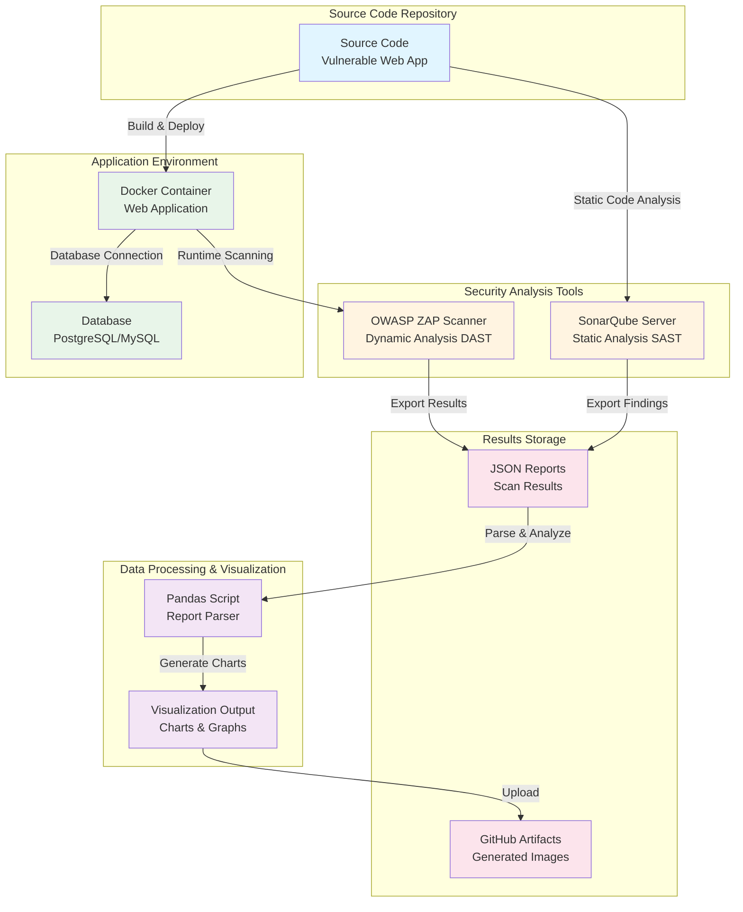
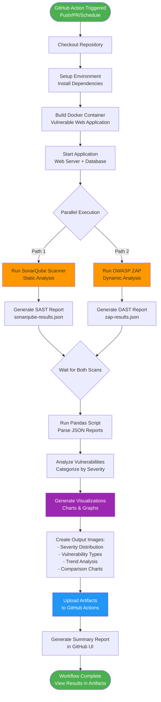
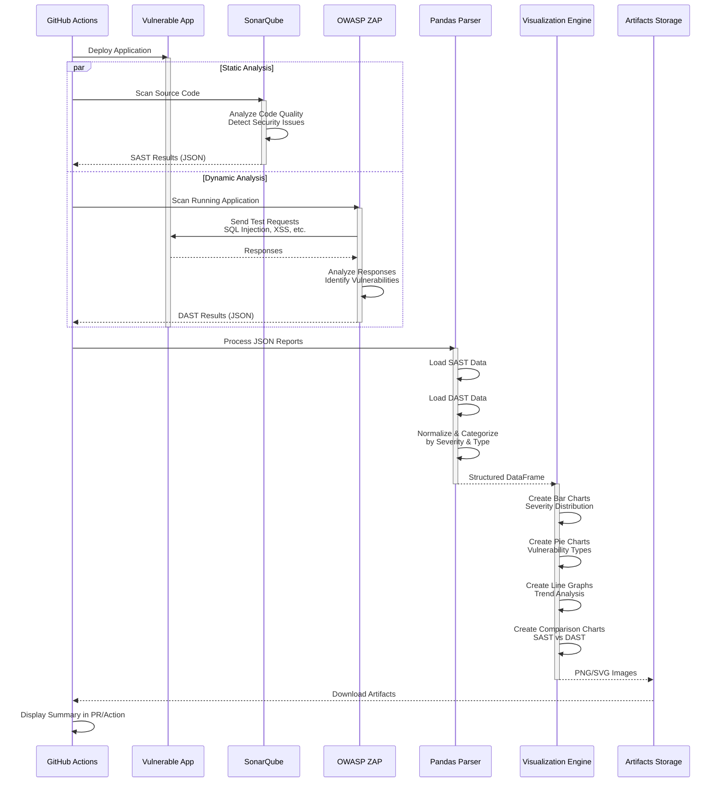

# DAST & SAST Security Testing Pipeline


> **A comprehensive, beginner-friendly security testing framework combining Static Application Security Testing (SAST) and Dynamic Application Security Testing (DAST) with automated visualization of results.**

This project demonstrates how to integrate security scanning tools into your development workflow, making security testing accessible to developers with little to no prior experience with security tooling.

---

## 📋 Table of Contents

- [Overview](#overview)
- [Architecture](#architecture)
- [Workflow](#workflow)
- [Data Flow](#data-flow)
- [Components](#components)
- [Getting Started](#getting-started)
- [Understanding the Results](#understanding-the-results)
- [For Beginners](#for-beginners)
- [Resources](#resources)
- [Contributing](#contributing)

---

## 🎯 Overview

This project provides a complete security testing pipeline that:

1. **Scans your code** for security vulnerabilities (SAST) using SonarQube
2. **Tests your running application** for runtime vulnerabilities (DAST) using OWASP ZAP
3. **Generates visual reports** showing security findings in easy-to-understand charts
4. **Runs automatically** via GitHub Actions on every code push or pull request
5. **Provides educational value** by demonstrating both types of security testing

### What is SAST vs DAST?

| **SAST (Static Analysis)** | **DAST (Dynamic Analysis)** |
|----------------------------|------------------------------|
| Analyzes source code without running it | Tests the running application |
| Finds coding errors and security flaws | Finds runtime vulnerabilities |
| Works like a code review | Works like a penetration test |
| Fast, early in development | Slower, tests real behavior |
| Example: SonarQube | Example: OWASP ZAP |

**Why use both?** SAST and DAST complement each other. SAST catches issues in the code, while DAST finds problems that only appear when the application is running. Together, they provide comprehensive security coverage.

---

## 🏗️ Architecture

The following diagram shows how all components interact in this security testing pipeline:



### Architecture Components Explained:

1. **Source Code Repository**: Your application code that will be tested
2. **SonarQube Server**: Analyzes your code for bugs, vulnerabilities, and code smells
3. **OWASP ZAP Scanner**: Tests your running application for security vulnerabilities
4. **Docker Container**: Hosts the vulnerable web application for testing
5. **Database**: Backend data storage (PostgreSQL, MySQL, etc.)
6. **Pandas Script**: Python script that parses JSON reports from scans
7. **Visualization Output**: Generates charts and graphs from security findings
8. **JSON Reports**: Structured data containing all scan results
9. **GitHub Artifacts**: Stores generated images and reports for download

---

## 🔄 Workflow

Here's what happens when the GitHub Action runs:



### Workflow Steps Explained:

1. **Trigger**: Action starts on push, pull request, or scheduled run
2. **Setup**: Installs Python, Docker, and required dependencies
3. **Build**: Creates Docker container with the vulnerable application
4. **Parallel Scanning**: Both SAST and DAST run simultaneously to save time
5. **Report Generation**: Each scanner exports findings as JSON
6. **Data Processing**: Pandas script combines and analyzes both reports
7. **Visualization**: Creates charts showing vulnerability distribution
8. **Artifact Upload**: Images are saved and can be downloaded from GitHub
9. **Summary**: GitHub UI shows a summary of findings

---

## 📊 Data Flow

This sequence diagram shows the detailed interaction between components:



---

## 🧩 Components

### 1. SonarQube (SAST) ✅ IMPLEMENTED

**What it does**: Analyzes your source code to find bugs, vulnerabilities, and code quality issues.

**Key Features**:
- Detects security vulnerabilities in code
- Finds code smells and maintainability issues
- Tracks code coverage from tests
- Shows technical debt
- Supports 25+ programming languages
- **Industry Standard**: Used by 400,000+ organizations worldwide

**How it works**: SonarQube reads your source files and uses pattern matching and data flow analysis to identify potential security issues without running the code.

**In This Project**:
- Runs in Docker container
- Scans Python code in dbaba application
- Exports JSON results for visualization
- Web UI available at http://localhost:9000

### 2. OWASP ZAP (DAST) ✅ IMPLEMENTED

**What it does**: Tests your running web application by simulating attacks.

**Key Features**:
- Active scanning (sends malicious payloads)
- Passive scanning (analyzes traffic)
- Spider/crawler to discover all pages
- AJAX spider for modern single-page apps
- API scanning support
- Completely free and open-source
- **Industry Standard**: Most widely used DAST tool globally

**How it works**: ZAP acts like an attacker, sending various types of malicious requests to your application and analyzing the responses to find vulnerabilities like SQL injection, XSS, and authentication issues.

**Official Site**: [zaproxy.org](https://www.zaproxy.org/)

**In This Project**:
- Runs in Docker container (daemon mode)
- Spiders and actively scans DBABA web application
- Tests for OWASP Top 10 vulnerabilities
- Exports HTML, XML, and JSON reports
- Results visualized in combined dashboard

### 3. Pandas Visualization Script

**What it does**: Processes scan results and creates visual charts.

**Capabilities**:
- Parses JSON reports from both scanners
- Normalizes data into consistent format
- Categorizes vulnerabilities by severity and type
- Generates multiple chart types:
  - Bar charts for severity distribution
  - Pie charts for vulnerability categories
  - Line graphs for trends over time
  - Comparison charts (SAST vs DAST)
- Exports publication-ready images (PNG/SVG)

### 4. Vulnerable Web Application

A deliberately insecure web application used for demonstration and testing purposes. Contains common vulnerabilities like:
- SQL Injection
- Cross-Site Scripting (XSS)
- Insecure Authentication
- Sensitive Data Exposure
- Security Misconfiguration

**⚠️ Warning**: Never deploy the vulnerable app to production!

---

## 🚀 Getting Started

### Prerequisites

- **Docker** and **Docker Compose**
- **Python 3.9+** with pip
- **Git**
- **curl**, **jq**, **wget** (for scripts)

### Quick Start (Complete Pipeline)

```bash
# Clone the repository
git clone https://github.com/noahwilliamshaffer/dbaba-security-testing.git
cd dbaba-security-testing

# Install Python dependencies
pip3 install -r requirements.txt

# Run complete SAST + DAST pipeline
bash scripts/run_all_scans.sh
```

This will:
1. Start SonarQube, OWASP ZAP, and DBABA app in Docker
2. Run SAST scan with SonarQube
3. Run DAST scan with OWASP ZAP
4. Generate visual reports and charts
5. Create comprehensive HTML report

**Time:** ~10-15 minutes (first run)

### Step-by-Step Manual Execution

```bash
# 1. Start services
docker-compose up -d

# Wait 2-3 minutes for services to start

# 2. Run SonarQube SAST scan
bash scripts/run_sonarqube_scan.sh

# 3. Run OWASP ZAP DAST scan
bash scripts/run_zap_scan.sh

# 4. Generate combined visualizations
python3 scripts/visualize_combined_results.py

# 5. View results
# - SonarQube UI: http://localhost:9000 (admin/admin)
# - ZAP Report: results/zap/zap_report.html
# - Combined Report: results/visualizations/combined_security_report.html
```

### Detailed Instructions

See **[SCAN_GUIDE.md](SCAN_GUIDE.md)** for complete documentation including:
- Detailed setup instructions
- Troubleshooting guide
- Configuration options
- Results interpretation
- CI/CD integration examples

### GitHub Actions Setup

See `.github/workflows/` directory for example CI/CD workflows (coming soon)

---

## 📈 Understanding the Results

### Reading the Charts

The visualization script generates several types of charts:

#### 1. Severity Distribution Chart
Shows count of issues by severity level:
- 🔴 **Critical/High**: Fix immediately
- 🟠 **Medium**: Address soon
- 🟡 **Low**: Fix when convenient
- 🟢 **Info**: Good to know

#### 2. Vulnerability Type Chart
Shows what types of vulnerabilities were found:
- SQL Injection
- Cross-Site Scripting (XSS)
- Authentication Issues
- Configuration Problems
- And more...

#### 3. SAST vs DAST Comparison
Compares findings from both scan types:
- Some issues only appear in code (SAST)
- Some only appear at runtime (DAST)
- Some are found by both

#### 4. Trend Analysis
Shows how security improves over time:
- Track vulnerability count across commits
- See if you're fixing issues faster than creating new ones
- Monitor overall security posture

### What the Scan Tools Show

For detailed information about SonarQube and OWASP ZAP interfaces, see:
- **[Screenshots and UI Guide](docs/SCREENSHOTS.md)** - Detailed explanation of what successful scans look like

---

## 👨‍🎓 For Beginners

### "I've never done security testing before"

No problem! This project is designed to teach you:

**Step 1: Understanding the Basics**
- Read the [OWASP Top 10](https://owasp.org/www-project-top-ten/) to learn about common vulnerabilities
- Watch the architecture diagram above to see how components connect

**Step 2: Run Your First Scan**
- Fork this repo
- Let GitHub Actions run automatically
- Download the visualization artifacts
- Look at the pretty charts! 📊

**Step 3: Understanding Findings**
- High severity = bad, fix first
- Low severity = not urgent, but still improve
- Read the descriptions of each vulnerability
- Learn why each issue is dangerous

**Step 4: Learn to Fix Issues**
- Start with one vulnerability type
- Research how to fix it properly
- Apply the fix to the vulnerable app
- Re-run scans to verify the fix worked

**Step 5: Integrate Into Your Projects**
- Copy the GitHub Action workflow
- Add security scanning to your real projects
- Make security part of your normal development process

### Common Questions

**Q: Will these scans break my build?**
A: By default, no. The workflow runs scans and generates reports but doesn't fail your build. You can configure it to fail on high-severity issues.

**Q: How long does scanning take?**
A: SAST: 2-5 minutes. DAST: 5-15 minutes depending on application size.

**Q: Is this free?**
A: Yes! OWASP ZAP is completely free. SonarQube has a free community edition. GitHub Actions has free tier limits.

**Q: Can I use this for production apps?**
A: The scanning tools, yes. The vulnerable web app, absolutely not!

**Q: Do I need to be a security expert?**
A: No! This project helps you learn. Start simple, improve over time.

---

## 📚 Resources

### Security Testing Tools
- [SonarQube Documentation](https://docs.sonarqube.org/)
- [OWASP ZAP User Guide](https://www.zaproxy.org/docs/)
- [ZAP Getting Started](https://www.zaproxy.org/getting-started/)

### Learning Security
- [OWASP Top 10](https://owasp.org/www-project-top-ten/)
- [OWASP Cheat Sheet Series](https://cheatsheetseries.owasp.org/)
- [CWE (Common Weakness Enumeration)](https://cwe.mitre.org/)
- [OWASP WebGoat](https://owasp.org/www-project-webgoat/) - Interactive security lessons

### Python Data Visualization
- [Pandas Documentation](https://pandas.pydata.org/docs/)
- [Matplotlib Gallery](https://matplotlib.org/stable/gallery/index.html)
- [Seaborn Tutorial](https://seaborn.pydata.org/tutorial.html)

### CI/CD Security
- [GitHub Actions Security Best Practices](https://docs.github.com/en/actions/security-guides)
- [DevSecOps Best Practices](https://owasp.org/www-project-devsecops-guideline/)

---

## 🤝 Contributing

Contributions are welcome! Whether you're:
- Fixing bugs
- Adding new features
- Improving documentation
- Adding more visualizations
- Suggesting better security practices

Please:
1. Fork the repository
2. Create a feature branch
3. Make your changes
4. Add tests if applicable
5. Submit a pull request

---

## 📄 License

This project is licensed under the MIT License - see the LICENSE file for details.

---

## ⚠️ Disclaimer

This project contains a deliberately vulnerable web application for educational purposes. **Never deploy the vulnerable application to a production environment or expose it to the internet.** The purpose is to learn about security testing in a safe, controlled environment.

---

## 🌟 Acknowledgments

- **OWASP** for providing free, world-class security tools and resources
- **SonarSource** for the SonarQube platform
- The **security research community** for continuously improving these tools
- All contributors to this project

---

## 📞 Support

- 📖 Check the [docs](docs/) folder for detailed guides
- 🐛 Report issues on the [GitHub Issues](https://github.com/noahwilliamshaffer/Dast-Sast/issues) page
- 💬 Ask questions in [Discussions](https://github.com/noahwilliamshaffer/Dast-Sast/discussions)

---

**Happy Secure Coding! 🔒**
