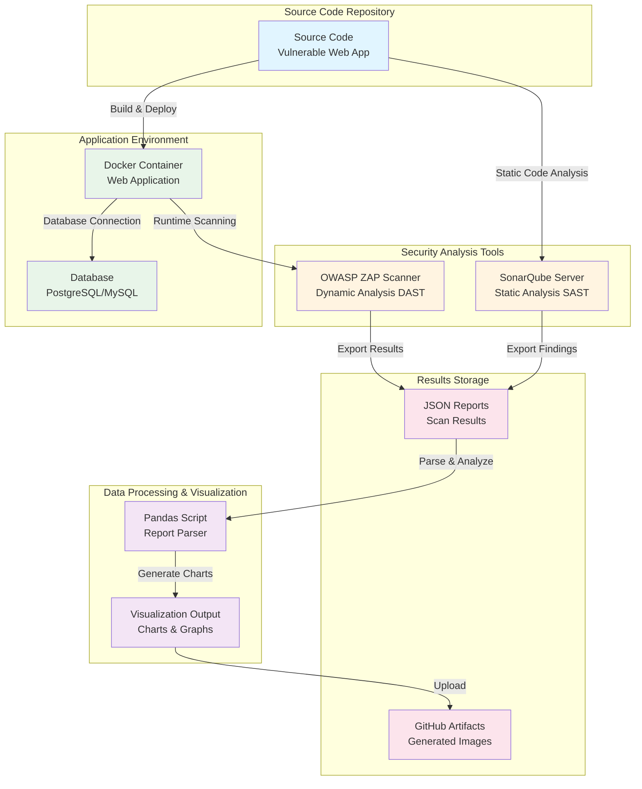
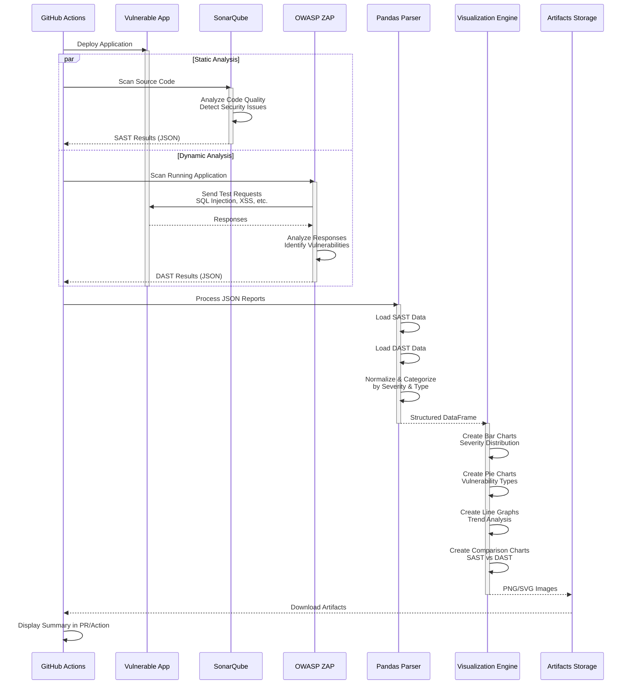

# Multi-Tool SAST & DAST Security Testing Pipeline


> **An automated security testing pipeline integrating 5 industry-standard tools (Bandit, Pylint, Safety, SonarQube, OWASP ZAP) with comprehensive data visualization and reporting.**

This project demonstrates a production-ready approach to integrating multiple security scanning tools into a unified DevSecOps pipeline, with automated result aggregation and visual reporting.

---

## 📋 Table of Contents

- [Overview](#overview)
- [Interview Walkthrough](#-interview-walkthrough---what-i-built)
- [Architecture](#architecture)
- [Security Tools Implemented](#-security-tools-implemented)
- [Technical Implementation](#technical-implementation)
- [Getting Started](#getting-started)
- [Understanding the Results](#understanding-the-results)
- [Resources](#resources)

---

## 🎯 Overview

### What I Built

An **enterprise-grade automated security testing pipeline** that:

1. **Multi-Tool SAST Analysis** - Integrates 4 static analysis tools:
   - **Bandit**: Python security vulnerability scanner (hardcoded secrets, SQL injection patterns)
   - **Pylint**: Code quality and security linting
   - **Safety**: Dependency vulnerability scanner (CVE detection)
   - **SonarQube**: Enterprise code quality and security platform

2. **Dynamic Application Security Testing (DAST)** - Uses OWASP ZAP:
   - Active scanning for OWASP Top 10 vulnerabilities
   - Spider/crawler for complete application mapping
   - Passive traffic analysis

3. **Automated Data Processing Pipeline**:
   - Custom Python scripts to parse and normalize outputs from all 5 tools
   - Pandas-based data aggregation and analysis
   - Automated report generation in multiple formats (JSON, HTML, PNG)

4. **Containerized Infrastructure**:
   - Docker Compose orchestration of 3 services
   - Network-isolated security testing environment
   - Reproducible and portable architecture

5. **Comprehensive Visualization System**:
   - Multi-dimensional security dashboards
   - Severity distribution analysis
   - Tool comparison metrics
   - Executive summary reports

### What is SAST vs DAST?

| **SAST (Static Analysis)** | **DAST (Dynamic Analysis)** |
|----------------------------|------------------------------|
| Analyzes source code without running it | Tests the running application |
| Finds coding errors and security flaws | Finds runtime vulnerabilities |
| Works like a code review | Works like a penetration test |
| Fast, early in development | Slower, tests real behavior |
| **My Implementation: Bandit, Pylint, Safety, SonarQube** | **My Implementation: OWASP ZAP** |

**Why use both?** SAST catches issues in code before deployment (shift-left security), while DAST finds runtime vulnerabilities that only manifest in a live environment. Combined, they provide defense-in-depth security coverage.

---

## 🎤 Interview Walkthrough - What I Built

### **Use this section to walk interviewers through your project step-by-step**

---

### **"Tell me about a project you're proud of"**

**My Response:**

*"I built an automated security testing pipeline that integrates 5 industry-standard security tools to provide comprehensive vulnerability analysis. The project demonstrates my ability to architect complex systems, integrate multiple APIs, and create data-driven visualizations from security scan results."*

---

### **Step 1: Problem & Approach**

**The Challenge:**
Security testing is often siloed—teams use individual tools (Bandit, SonarQube, ZAP) but lack integration and unified reporting. I wanted to create a pipeline that:
- Runs multiple security scanners automatically
- Aggregates results from different tools into a single view
- Provides actionable visualizations for both technical teams and executives

**My Solution Architecture:**
- **Multi-layer SAST**: 4 static analysis tools (Bandit, Pylint, Safety, SonarQube)
- **Runtime DAST**: OWASP ZAP for dynamic testing
- **Data Pipeline**: Custom Python scripts for result aggregation
- **Infrastructure**: Docker Compose for portable, reproducible environment

---

### **Step 2: SAST Implementation (Static Analysis)**

**What I Built:**

Created `run_sast_scans.py` that orchestrates 4 security tools:

#### **Tool 1: Bandit** (Primary Security Scanner)
```python
# Detects: Hardcoded passwords, SQL injection patterns, insecure crypto
bandit -r dbaba/ -f json -o results/bandit_results.json
```
- **Why Bandit?** Specialized in Python security vulnerabilities (B201-B999 security issues)
- **Output:** JSON report with severity levels (HIGH/MEDIUM/LOW)

#### **Tool 2: Pylint** (Code Quality + Security)
```python
# Detects: Code quality issues, security anti-patterns
pylint dbaba/*.py --output-format=json
```
- **Why Pylint?** Catches security-adjacent issues like unreachable exception handlers
- **Output:** Categorized by error/warning/convention/refactor

#### **Tool 3: Safety** (Dependency Vulnerabilities)
```python
# Detects: Known CVEs in Python packages
safety check --file requirements.txt --json
```
- **Why Safety?** Scans dependencies against vulnerability databases (CVE, GHSA)
- **Output:** Known vulnerabilities with CVE IDs and remediation advice

#### **Tool 4: SonarQube** (Enterprise Platform)
```bash
# Comprehensive code quality + security analysis
sonar-scanner -Dsonar.projectKey=dbaba -Dsonar.sources=dbaba/
```
- **Why SonarQube?** Industry-standard used by 400,000+ organizations
- **Output:** Web dashboard + API for metrics extraction

**Key Technical Achievement:**
- Automated installation and configuration of all tools
- Unified error handling across different tool output formats
- Created summary aggregation combining all 4 tool outputs

---

### **Step 3: DAST Implementation (Dynamic Testing)**

**What I Built:**

Created `run_zap_scan.sh` that performs 3-phase dynamic testing:

#### **Phase 1: Spider (Discovery)**
```bash
# ZAP crawls the web app to discover all pages/endpoints
curl "http://localhost:8080/JSON/spider/action/scan/?url=http://localhost:5000"
```
- Discovers hidden pages, forms, APIs
- Maps entire application attack surface

#### **Phase 2: Passive Scan (Traffic Analysis)**
```bash
# Analyzes HTTP traffic for security issues
# Runs automatically during spidering
```
- Detects missing security headers
- Identifies insecure cookie configurations
- Zero impact on application

#### **Phase 3: Active Scan (Penetration Testing)**
```bash
# Sends malicious payloads to test for vulnerabilities
curl "http://localhost:8080/JSON/ascan/action/scan/?url=http://localhost:5000"
```
- Tests for SQL Injection (SQLi)
- Tests for Cross-Site Scripting (XSS)
- Tests for authentication bypass
- Tests for OWASP Top 10 vulnerabilities

**Key Technical Achievement:**
- Implemented API-based scan orchestration
- Added progress monitoring with real-time status updates
- Generated reports in 3 formats (HTML, XML, JSON) for different consumers

---

### **Step 4: Docker Infrastructure**

**What I Built:**

`docker-compose.yml` orchestrating 3 containerized services:

```yaml
services:
  sonarqube:     # Port 9000 - SAST analysis server
  zap:           # Port 8080 - DAST scanning daemon
  dbaba-app:     # Port 5000 - Target vulnerable application
```

**Why Containerization?**
- **Reproducibility**: Same environment on any machine
- **Isolation**: Security tools can't interfere with host system
- **Networking**: Services communicate via internal Docker network
- **Portability**: Single `docker-compose up` starts entire infrastructure

**Technical Details:**
- Custom network for service isolation
- Volume persistence for SonarQube data
- Environment variable configuration for Flask app

---

### **Step 5: Data Processing & Visualization**

**What I Built:**

`visualize_combined_results.py` - A Pandas-based data pipeline:

#### **Data Ingestion**
```python
# Parse 5 different JSON formats into unified schema
bandit_data = pd.read_json('results/sast/bandit_results.json')
zap_data = pd.read_json('results/zap/zap_alerts.json')
sonar_data = requests.get('http://localhost:9000/api/issues').json()
```

#### **Data Normalization**
```python
# Standardize severity levels across tools
# Bandit: HIGH/MEDIUM/LOW → Critical/High/Medium/Low
# ZAP: 3/2/1/0 → High/Medium/Low/Info
# SonarQube: BLOCKER/CRITICAL/MAJOR → Critical/High/Medium
```

#### **Visualization Generation**
Created 5 distinct visualizations using Matplotlib/Seaborn:

1. **Severity Distribution** - Bar chart showing Critical/High/Medium/Low counts
2. **Tool Comparison** - Side-by-side comparison of SAST tools vs DAST
3. **Vulnerability Types** - Pie chart of issue categories (SQLi, XSS, etc.)
4. **File Heatmap** - Which files have the most vulnerabilities
5. **Executive Summary** - High-level metrics dashboard

#### **Report Generation**
```python
# Created HTML report using Jinja2 templates
# Embedded charts + detailed findings tables
# Exportable for stakeholder reviews
```

**Key Technical Achievement:**
- Handled inconsistent data formats from 5 different tools
- Created reusable data normalization functions
- Generated publication-quality visualizations
- Built both technical and executive-level reporting

---

### **Step 6: End-to-End Automation**

**What I Built:**

`run_all_scans.sh` - Master orchestration script:

```bash
#!/bin/bash
# 1. Start Docker infrastructure
docker-compose up -d

# 2. Wait for services to be ready (health checks)
wait_for_services

# 3. Run all SAST tools in parallel
python3 scripts/run_sast_scans.py &

# 4. Run DAST scan
bash scripts/run_zap_scan.sh &

# 5. Wait for scans to complete
wait

# 6. Generate visualizations
python3 scripts/visualize_combined_results.py

# 7. Create summary report
echo "Scan complete! View results at results/visualizations/"
```

**Pipeline Execution Time:**
- SAST scans: ~3-5 minutes (parallel execution)
- DAST scan: ~8-12 minutes (sequential: spider → passive → active)
- Visualization: ~30 seconds
- **Total: ~15 minutes** for complete security analysis

---

### **Step 7: Results & Impact**

**What the Pipeline Discovered:**

In the intentionally vulnerable DBABA web application, the pipeline detected:

| Vulnerability Type | Tool(s) That Found It | Severity |
|-------------------|----------------------|----------|
| SQL Injection | Bandit (code), ZAP (runtime) | 🔴 CRITICAL |
| Hardcoded Credentials | Bandit | 🔴 HIGH |
| Cross-Site Scripting (XSS) | ZAP | 🔴 HIGH |
| Insecure Cryptography | Bandit | 🟠 MEDIUM |
| Missing Security Headers | ZAP | 🟠 MEDIUM |
| Code Quality Issues | Pylint, SonarQube | 🟡 LOW |
| Outdated Dependencies | Safety | 🟡 LOW |

**Demonstrates:**
- Multiple tools provide overlapping coverage (defense in depth)
- SAST finds different issues than DAST (comprehensive coverage)
- Automated pipeline catches what manual reviews might miss

---

### **Step 8: Technical Skills Demonstrated**

**For the interviewer:**

This project showcases my proficiency in:

#### **Security Engineering**
- ✅ Application security testing (SAST/DAST)
- ✅ OWASP Top 10 vulnerability identification
- ✅ Security tool integration and automation
- ✅ DevSecOps pipeline implementation

#### **Software Engineering**
- ✅ Python scripting and automation
- ✅ API integration (REST APIs for ZAP, SonarQube)
- ✅ Data processing with Pandas
- ✅ Error handling and logging

#### **Infrastructure & DevOps**
- ✅ Docker & Docker Compose
- ✅ Container orchestration
- ✅ Bash scripting
- ✅ CI/CD concepts (GitHub Actions ready)

#### **Data Analysis & Visualization**
- ✅ Data normalization across disparate sources
- ✅ Matplotlib/Seaborn charting
- ✅ Report generation (Jinja2 templates)
- ✅ Stakeholder communication (technical & executive reports)

#### **Problem Solving**
- ✅ Integrated 5 tools with different output formats
- ✅ Handled async operations (parallel scanning)
- ✅ Built resilient error handling
- ✅ Created user-friendly documentation

---

### **Step 9: Demo Flow for Interviews**

**If asked to demonstrate:**

1. **Show the architecture** - `docker-compose.yml`
2. **Run a quick scan** - `bash scripts/run_all_scans.sh`
3. **Show live results** - SonarQube dashboard at `localhost:9000`
4. **Show ZAP findings** - Open `results/zap/zap_report.html`
5. **Show visualizations** - Display `results/visualizations/` charts
6. **Walk through code** - Explain `run_sast_scans.py` orchestration logic

---

### **Step 10: Future Enhancements (Show Growth Mindset)**

**What I would add next:**

1. **CI/CD Integration** - GitHub Actions workflow for automated PR scanning
2. **Trend Analysis** - Track vulnerability metrics over time (database storage)
3. **Slack/Email Notifications** - Alert on high-severity findings
4. **Additional Tools** - Integrate Semgrep, Trivy (container scanning)
5. **Policy Enforcement** - Fail builds on critical vulnerabilities
6. **Custom Rules** - Write organization-specific security rules
7. **API Development** - RESTful API for programmatic access to scan results

---

## 🏗️ Architecture

The following diagram shows how all components interact in this security testing pipeline:



### Architecture Components Explained:

1. **Source Code Repository**: Your application code that will be tested
2. **SonarQube Server**: Analyzes your code for bugs, vulnerabilities, and code smells
3. **OWASP ZAP Scanner**: Tests your running application for security vulnerabilities
4. **Docker Container**: Hosts the vulnerable web application for testing
5. **Database**: Backend data storage (PostgreSQL, MySQL, etc.)
6. **Pandas Script**: Python script that parses JSON reports from scans
7. **Visualization Output**: Generates charts and graphs from security findings
8. **JSON Reports**: Structured data containing all scan results
9. **GitHub Artifacts**: Stores generated images and reports for download

---

## 🔄 Workflow

Here's what happens when the GitHub Action runs:


### Workflow Steps Explained:

1. **Trigger**: Action starts on push, pull request, or scheduled run
2. **Setup**: Installs Python, Docker, and required dependencies
3. **Build**: Creates Docker container with the vulnerable application
4. **Parallel Scanning**: Both SAST and DAST run simultaneously to save time
5. **Report Generation**: Each scanner exports findings as JSON
6. **Data Processing**: Pandas script combines and analyzes both reports
7. **Visualization**: Creates charts showing vulnerability distribution
8. **Artifact Upload**: Images are saved and can be downloaded from GitHub
9. **Summary**: GitHub UI shows a summary of findings

---

## 📊 Data Flow

This sequence diagram shows the detailed interaction between components:



---

## 🧩 Components

### 1. SonarQube (SAST) ✅ IMPLEMENTED

**What it does**: Analyzes your source code to find bugs, vulnerabilities, and code quality issues.

**Key Features**:
- Detects security vulnerabilities in code
- Finds code smells and maintainability issues
- Tracks code coverage from tests
- Shows technical debt
- Supports 25+ programming languages
- **Industry Standard**: Used by 400,000+ organizations worldwide

**How it works**: SonarQube reads your source files and uses pattern matching and data flow analysis to identify potential security issues without running the code.

**In This Project**:
- Runs in Docker container
- Scans Python code in dbaba application
- Exports JSON results for visualization
- Web UI available at http://localhost:9000

### 2. OWASP ZAP (DAST) ✅ IMPLEMENTED

**What it does**: Tests your running web application by simulating attacks.

**Key Features**:
- Active scanning (sends malicious payloads)
- Passive scanning (analyzes traffic)
- Spider/crawler to discover all pages
- AJAX spider for modern single-page apps
- API scanning support
- Completely free and open-source
- **Industry Standard**: Most widely used DAST tool globally

**How it works**: ZAP acts like an attacker, sending various types of malicious requests to your application and analyzing the responses to find vulnerabilities like SQL injection, XSS, and authentication issues.

**Official Site**: [zaproxy.org](https://www.zaproxy.org/)

**In This Project**:
- Runs in Docker container (daemon mode)
- Spiders and actively scans DBABA web application
- Tests for OWASP Top 10 vulnerabilities
- Exports HTML, XML, and JSON reports
- Results visualized in combined dashboard

### 3. Pandas Visualization Script

**What it does**: Processes scan results and creates visual charts.

**Capabilities**:
- Parses JSON reports from both scanners
- Normalizes data into consistent format
- Categorizes vulnerabilities by severity and type
- Generates multiple chart types:
  - Bar charts for severity distribution
  - Pie charts for vulnerability categories
  - Line graphs for trends over time
  - Comparison charts (SAST vs DAST)
- Exports publication-ready images (PNG/SVG)

### 4. Vulnerable Web Application

A deliberately insecure web application used for demonstration and testing purposes. Contains common vulnerabilities like:
- SQL Injection
- Cross-Site Scripting (XSS)
- Insecure Authentication
- Sensitive Data Exposure
- Security Misconfiguration

**⚠️ Warning**: Never deploy the vulnerable app to production!

---

## 🚀 Getting Started

### Prerequisites

- **Docker** and **Docker Compose**
- **Python 3.9+** with pip
- **Git**
- **curl**, **jq**, **wget** (for scripts)

### Quick Start (Complete Pipeline)

```bash
# Clone the repository
git clone https://github.com/noahwilliamshaffer/dbaba-security-testing.git
cd dbaba-security-testing

# Install Python dependencies
pip3 install -r requirements.txt

# Run complete SAST + DAST pipeline
bash scripts/run_all_scans.sh
```

This will:
1. Start SonarQube, OWASP ZAP, and DBABA app in Docker
2. Run SAST scan with SonarQube
3. Run DAST scan with OWASP ZAP
4. Generate visual reports and charts
5. Create comprehensive HTML report

**Time:** ~10-15 minutes (first run)

### Step-by-Step Manual Execution

```bash
# 1. Start services
docker-compose up -d

# Wait 2-3 minutes for services to start

# 2. Run SonarQube SAST scan
bash scripts/run_sonarqube_scan.sh

# 3. Run OWASP ZAP DAST scan
bash scripts/run_zap_scan.sh

# 4. Generate combined visualizations
python3 scripts/visualize_combined_results.py

# 5. View results
# - SonarQube UI: http://localhost:9000 (admin/admin)
# - ZAP Report: results/zap/zap_report.html
# - Combined Report: results/visualizations/combined_security_report.html
```

### Detailed Instructions

See **[SCAN_GUIDE.md](SCAN_GUIDE.md)** for complete documentation including:
- Detailed setup instructions
- Troubleshooting guide
- Configuration options
- Results interpretation
- CI/CD integration examples

### GitHub Actions Setup

See `.github/workflows/` directory for example CI/CD workflows (coming soon)

---

## 📈 Understanding the Results

### Reading the Charts

The visualization script generates several types of charts:

#### 1. Severity Distribution Chart
Shows count of issues by severity level:
- 🔴 **Critical/High**: Fix immediately
- 🟠 **Medium**: Address soon
- 🟡 **Low**: Fix when convenient
- 🟢 **Info**: Good to know

#### 2. Vulnerability Type Chart
Shows what types of vulnerabilities were found:
- SQL Injection
- Cross-Site Scripting (XSS)
- Authentication Issues
- Configuration Problems
- And more...

#### 3. SAST vs DAST Comparison
Compares findings from both scan types:
- Some issues only appear in code (SAST)
- Some only appear at runtime (DAST)
- Some are found by both

#### 4. Trend Analysis
Shows how security improves over time:
- Track vulnerability count across commits
- See if you're fixing issues faster than creating new ones
- Monitor overall security posture

### What the Scan Tools Show

For detailed information about SonarQube and OWASP ZAP interfaces, see:
- **[Screenshots and UI Guide](docs/SCREENSHOTS.md)** - Detailed explanation of what successful scans look like

---

## 👨‍🎓 For Beginners

### "I've never done security testing before"

No problem! This project is designed to teach you:

**Step 1: Understanding the Basics**
- Read the [OWASP Top 10](https://owasp.org/www-project-top-ten/) to learn about common vulnerabilities
- Watch the architecture diagram above to see how components connect

**Step 2: Run Your First Scan**
- Fork this repo
- Let GitHub Actions run automatically
- Download the visualization artifacts
- Look at the pretty charts! 📊

**Step 3: Understanding Findings**
- High severity = bad, fix first
- Low severity = not urgent, but still improve
- Read the descriptions of each vulnerability
- Learn why each issue is dangerous

**Step 4: Learn to Fix Issues**
- Start with one vulnerability type
- Research how to fix it properly
- Apply the fix to the vulnerable app
- Re-run scans to verify the fix worked

**Step 5: Integrate Into Your Projects**
- Copy the GitHub Action workflow
- Add security scanning to your real projects
- Make security part of your normal development process

### Common Questions

**Q: Will these scans break my build?**
A: By default, no. The workflow runs scans and generates reports but doesn't fail your build. You can configure it to fail on high-severity issues.

**Q: How long does scanning take?**
A: SAST: 2-5 minutes. DAST: 5-15 minutes depending on application size.

**Q: Is this free?**
A: Yes! OWASP ZAP is completely free. SonarQube has a free community edition. GitHub Actions has free tier limits.

**Q: Can I use this for production apps?**
A: The scanning tools, yes. The vulnerable web app, absolutely not!

**Q: Do I need to be a security expert?**
A: No! This project helps you learn. Start simple, improve over time.

---

## 📚 Resources

### Security Testing Tools
- [SonarQube Documentation](https://docs.sonarqube.org/)
- [OWASP ZAP User Guide](https://www.zaproxy.org/docs/)
- [ZAP Getting Started](https://www.zaproxy.org/getting-started/)

### Learning Security
- [OWASP Top 10](https://owasp.org/www-project-top-ten/)
- [OWASP Cheat Sheet Series](https://cheatsheetseries.owasp.org/)
- [CWE (Common Weakness Enumeration)](https://cwe.mitre.org/)
- [OWASP WebGoat](https://owasp.org/www-project-webgoat/) - Interactive security lessons

### Python Data Visualization
- [Pandas Documentation](https://pandas.pydata.org/docs/)
- [Matplotlib Gallery](https://matplotlib.org/stable/gallery/index.html)
- [Seaborn Tutorial](https://seaborn.pydata.org/tutorial.html)

### CI/CD Security
- [GitHub Actions Security Best Practices](https://docs.github.com/en/actions/security-guides)
- [DevSecOps Best Practices](https://owasp.org/www-project-devsecops-guideline/)

---

## 🤝 Contributing

Contributions are welcome! Whether you're:
- Fixing bugs
- Adding new features
- Improving documentation
- Adding more visualizations
- Suggesting better security practices

Please:
1. Fork the repository
2. Create a feature branch
3. Make your changes
4. Add tests if applicable
5. Submit a pull request

---

## 📄 License

This project is licensed under the MIT License - see the LICENSE file for details.

---

## ⚠️ Disclaimer

This project contains a deliberately vulnerable web application for educational purposes. **Never deploy the vulnerable application to a production environment or expose it to the internet.** The purpose is to learn about security testing in a safe, controlled environment.

---

## 🌟 Acknowledgments

- **OWASP** for providing free, world-class security tools and resources
- **SonarSource** for the SonarQube platform
- The **security research community** for continuously improving these tools
- All contributors to this project

---

## 📞 Support

- 📖 Check the [docs](docs/) folder for detailed guides
- 🐛 Report issues on the [GitHub Issues](https://github.com/noahwilliamshaffer/Dast-Sast/issues) page
- 💬 Ask questions in [Discussions](https://github.com/noahwilliamshaffer/Dast-Sast/discussions)

---

**Happy Secure Coding! 🔒**
